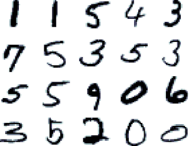
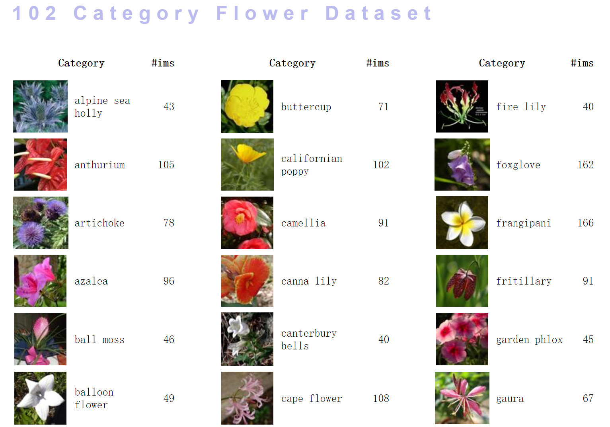
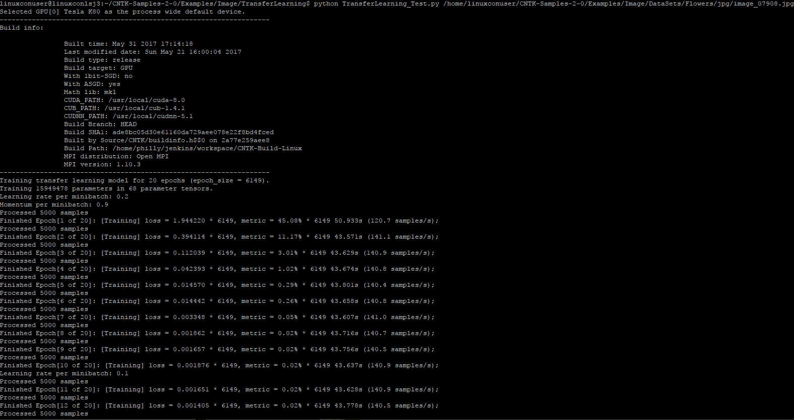
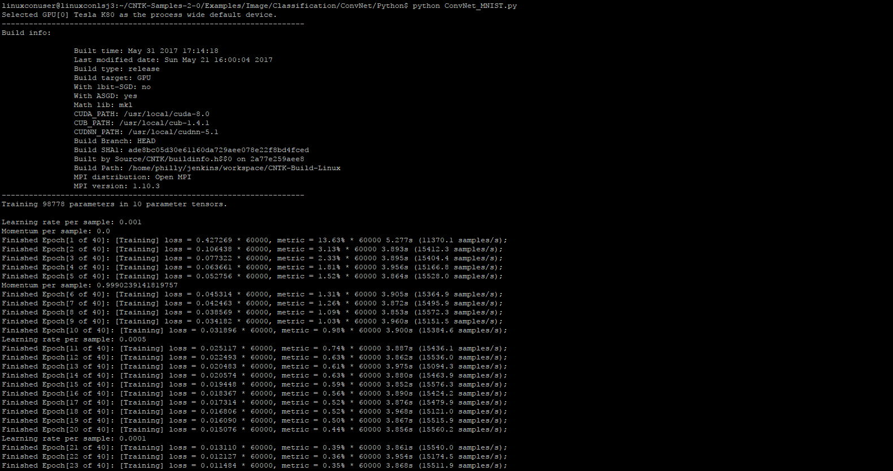
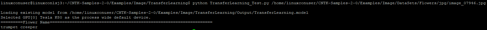

该动手实验指南介绍了如何通过CNTK在Azure基于Ubuntu系统的GPU虚拟机构建深度学习算法识别手写阿拉伯数字。

 
## CNTK介绍 ##
[CNTK](www.cntk.ai)是微软提供的开源、跨平台深度学习开发框架，通过将简单的模块组合成复杂的计算网络，来表达任意的神经网络。CNTK目前已经发布2.0版本，支持Python和C++开发，支持多GPU、多机器分布式计算。
 
## Azure GPU虚拟机 ##

Azure提供了多样的虚拟机类型，其中包括N系列GPU虚拟机。[N系列虚拟机](https://docs.microsoft.com/zh-cn/azure/virtual-machines/linux/sizes-gpu)非常适合计算和图形密集的工作负荷，采用 NVIDIA Tesla 加速平台和 NVIDIA GRID 2.0技术，提供当今云中最高端的图形支持。目前支持Windows和Linux系统。
 
## 实验介绍 ##

在这个40分钟的实验中，读者将学习如何在Ubuntu系统的Azure GPU虚拟机中，基于已配置好的CNTK开发环境，使用Python开发深度学习应用。这个实验包括两部分，第一部分是基于MNIST进行手写体数字识别，第二部分基于VGG的Flower数据集识别花的品种。

- *[MNIST](http://yann.lecun.com/exdb/mnist/)是一个手写数字数据集，包括60000个训练集和10000个测试集。数字尺寸上已经归一化，而且在图片的中间位置。*
- *[Visual Geometry Group](http://www.robots.ox.ac.uk/~vgg/data/flowers/102/index.html)是牛津大学提供的一组数据库。这次使用的数据库是包含102种分类的花数据库。这些花都是英国的常见品种，每一类包括40到258张图片。[下载地址](https://function39115e15b5cc.blob.core.windows.net/cntkdatafile/102flowers.zip)*



*Figure.1 MNIST数据集*



*Figure.2 VGG Flower图片集*

## 实验一 ##

通过这个实验学习如何通过开发卷积神经网络来进行MNIST手写数字识别。

MNIST每个图片为28*28大小，被序列化成feature，label是一个10维向量，具有唯一的1值，其位置表示该手写数字，比如3 : [0 0 0 1 0 0 0 0 0 0]。所有训练数据和测试数据分别被序列化成下面格式，组成训练和测试txt文件：

|labels 0 0 0 0 0 0 0 1 0 0 |features 0 0 0 0 0 0 0 0 0 0 0 0 0 0 0 0 0 0 0 0 0 0 0 0 0 0 0 0 0 0 0 0 0 0 0 0 0 0 0 0 0 0 0 0 0 0 0  222 254 254 254 254 241 198 198 198 198 198 198 198 198 170 52 0 0 0 0 0 0 0 0 0 0 0 0 67 114 72 114 163 227 254 225 254 254 254 250 229 254 254 140 0 0

MNIST数据集已经在预先下载到/home/linuxconuser/CNTK-Samples-2-0/Examples/Image/Datasets/MNIST里面。

在/home/linuxconuser/CNTK-Samples-2-0/Examples/Image/Classification/ConvNet/Python中创建新的py文件，开始编程实现MNIST识别。
```shell
vim ConvNet_MNIST_LinuxCon.py
```

1. 模块导入和定义文件路径
```Python
from __future__ import print_function
import numpy as np
import sys
import os
import cntk as C

# Paths relative to current python file.
abs_path   = os.path.dirname(os.path.abspath(__file__))
data_path  = os.path.join(abs_path, "..", "..", "..", "DataSets", "MNIST")
model_path = os.path.join(abs_path, "Models")
```

2. 创建Reader函数，用来读入训练和测试数据集，抽取feature和label，并打包成minibatch源文件。
```Python
# Define the reader for both training and evaluation action.
def create_reader(path, is_training, input_dim, label_dim):
    return C.io.MinibatchSource(C.io.CTFDeserializer(path, C.io.StreamDefs(
        features=C.io.StreamDef(field='features', shape=input_dim),
        labels=C.io.StreamDef(field='labels',   shape=label_dim)
    )), randomize=is_training, max_sweeps=C.io.INFINITELY_REPEAT if is_training else 1)
```

3. 创建和训练卷积神经网络分类模型

```Python
# Creates and trains a feedforward classification model for MNIST images
def convnet_mnist(debug_output=False, epoch_size=60000, minibatch_size=64, max_epochs=40):
```
定义输入图片尺寸、通道数、输出分类等参数，并创建训练集。
```Python
    image_height = 28
    image_width  = 28
    num_channels = 1
    input_dim = image_height * image_width * num_channels
    num_output_classes = 10
    reader_train = create_reader(os.path.join(data_path, 'Train-28x28_cntk_text.txt'), True, input_dim, num_output_classes)
```
定义输入训练数据和label，并归一化训练数据。
```Python
    # Input variables denoting the features and label data
    input_var = C.ops.input_variable((num_channels, image_height, image_width), np.float32)
    label_var = C.ops.input_variable(num_output_classes, np.float32)

    # Instantiate the feedforward classification model
    scaled_input = C.ops.element_times(C.ops.constant(0.00390625), input_var)
```
定义神经网络结构：采用三层卷积层，和两层池化，最后是全连接层和Dropout层。
```Python
    with C.layers.default_options(activation=C.ops.relu, pad=False):
        conv1 = C.layers.Convolution2D((5,5), 32, pad=True)(scaled_input)
        pool1 = C.layers.MaxPooling((3,3), (2,2))(conv1)
        conv2 = C.layers.Convolution2D((3,3), 48)(pool1)
        pool2 = C.layers.MaxPooling((3,3), (2,2))(conv2)
        conv3 = C.layers.Convolution2D((3,3), 64)(pool2)
        f4    = C.layers.Dense(96)(conv3)
        drop4 = C.layers.Dropout(0.5)(f4)
        z     = C.layers.Dense(num_output_classes, activation=None)(drop4)
```
定义不同的评价函数，ce是交叉熵，pe是误差率。
```Python
    ce = C.losses.cross_entropy_with_softmax(z, label_var)
    pe = C.metrics.classification_error(z, label_var)
```
设置训练参数，包括训练迭代步长、训练次数和训练时间等；设置训练方法为Momentum sgd方法。
```Python
    # Set learning parameters
    lr_per_sample    = [0.001]*10 + [0.0005]*10 + [0.0001]
    lr_schedule      = C.learning_rate_schedule(lr_per_sample, C.learners.UnitType.sample, epoch_size)
    mm_time_constant = [0]*5 + [1024]
    mm_schedule      = C.learners.momentum_as_time_constant_schedule(mm_time_constant, epoch_size)

    # Instantiate the trainer object to drive the model training
    learner = C.learners.momentum_sgd(z.parameters, lr_schedule, mm_schedule)
    progress_printer = C.logging.ProgressPrinter(tag='Training', num_epochs=max_epochs)
    trainer = C.Trainer(z, (ce, pe), learner, progress_printer)
```
定义输入训练集和神经网络输入的映射。
```Python
    # define mapping from reader streams to network inputs
    input_map = {
        input_var : reader_train.streams.features,
        label_var : reader_train.streams.labels
    }

    C.logging.log_number_of_parameters(z) ; print()
```
通过minibatch的数据训练模型，直到到达训练次数上限。
```Python
    # Get minibatches of images to train with and perform model training
    for epoch in range(max_epochs):       # loop over epochs
        sample_count = 0
        while sample_count < epoch_size:  # loop over minibatches in the epoch
            data = reader_train.next_minibatch(min(minibatch_size, epoch_size - sample_count), input_map=input_map) # fetch minibatch.
            trainer.train_minibatch(data)                                   # update model with it
            sample_count += data[label_var].num_samples                     # count samples processed so far

        trainer.summarize_training_progress()
        z.save(os.path.join(model_path, "ConvNet_MNIST_{}.dnn".format(epoch)))
```
输入测试数据集进行测试。
```Python
    # Load test data
    reader_test = create_reader(os.path.join(data_path, 'Test-28x28_cntk_text.txt'), False, input_dim, num_output_classes)

    input_map = {
        input_var : reader_test.streams.features,
        label_var : reader_test.streams.labels
    }

    # Test data for trained model
    epoch_size = 10000
    minibatch_size = 1024

    # process minibatches and evaluate the model
    metric_numer    = 0
    metric_denom    = 0
    sample_count    = 0
    minibatch_index = 0

    while sample_count < epoch_size:
        current_minibatch = min(minibatch_size, epoch_size - sample_count)

        # Fetch next test min batch.
        data = reader_test.next_minibatch(current_minibatch, input_map=input_map)

        # minibatch data to be trained with
        metric_numer += trainer.test_minibatch(data) * current_minibatch
        metric_denom += current_minibatch

        # Keep track of the number of samples processed so far.
        sample_count += data[label_var].num_samples
        minibatch_index += 1

    print("")
    print("Final Results: Minibatch[1-{}]: errs = {:0.2f}% * {}".format(minibatch_index+1, (metric_numer*100.0)/metric_denom, metric_denom))
    print("")

    return metric_numer/metric_denom
```
4. 主函数
```Python
if __name__=='__main__':
    convnet_mnist()
## Conclusion ##
```
5. 保存文件后在同一个目录下运行，运行结果可以看到该文件以GPU为运行平台，经过多次minibatch，最终达到0.02%的识别误差。
```shell
python ConvNet_MNIST_LinuxCon.py
```


*Figure.3 MNIST在卷积神经网络上的运行结果*

## 实验一总结 ##
实验一通过使用卷积神经网络识别MNIST手写数字集，展示了如何通过按层构建卷积神经网络，如何配置输入，训练函数和评价函数等。

## 实验二 ##

通过这个实验学习如何通过利用复杂深度学习网络解决实际问题——花朵分类问题。在进行这个实验前，请先从上面提供的Flower Dataset下载地址下载该数据集，解压缩后可以看到查看所有的花朵图片。

实际解决问题时往往不会重新训练深度学习网络，而是利用已有的网络，修改输出层，输入新的数据集进行训练，微调网络或者仅仅训练输出层，从而得到适应新数据集的深度网络。这被成为转移学习，TransferLearning。

这个实验我们将利用已有的Resnet 18层网络模型通过TransferLearning来训练得到花朵识别网络，最后还可以通过输入图片链接来测试网络的准确性。

FLowers数据集已经在预先下载到/home/linuxconuser/CNTK-Samples-2-0/Examples/Image/Datasets/Flowers/jpg里面。Resnet 18层模型也已经预装好，在/home/linuxconuser/CNTK-Samples-2-0/Examples/Image/PretrainedModels中。

在/home/linuxconuser/CNTK-Samples-2-0/Examples/Image/TransferLearning中创建新的py文件。
```shell
vim TransferLearning_LinuxCon.py
```
1. 导入开发环境，配置参数，包括图片尺寸、分类数、类别，基础模型位置、修改节点位置，训练和测试文件位置等。
```Python
from __future__ import print_function
import numpy as np
import cntk as C
import os
import sys
from PIL import Image
from cntk.device import try_set_default_device, gpu
from cntk import load_model, placeholder, Constant
from cntk import Trainer, UnitType
from cntk.logging.graph import find_by_name, get_node_outputs
from cntk.io import MinibatchSource, ImageDeserializer, StreamDefs, StreamDef
import cntk.io.transforms as xforms
from cntk.layers import Dense
from cntk.learners import momentum_sgd, learning_rate_schedule, momentum_schedule
from cntk.ops import combine, softmax
from cntk.ops.functions import CloneMethod
from cntk.losses import cross_entropy_with_softmax
from cntk.metrics import classification_error
from cntk.logging import log_number_of_parameters, ProgressPrinter


################################################
################################################
# general settings
make_mode = True
freeze_weights = False
base_folder = os.path.dirname(os.path.abspath(__file__))
tl_model_file = os.path.join(base_folder, "Output", "TransferLearning.model")
output_file = os.path.join(base_folder, "Output", "predOutput.txt")
features_stream_name = 'features'
label_stream_name = 'labels'
new_output_node_name = "prediction"

# Learning parameters
max_epochs = 20
mb_size = 50
lr_per_mb = [0.2]*10 + [0.1]
momentum_per_mb = 0.9
l2_reg_weight = 0.0005

# define base model location and characteristics
_base_model_file = os.path.join(base_folder, "..", "PretrainedModels", "ResNet_18.model")
_feature_node_name = "features"
_last_hidden_node_name = "z.x"
_image_height = 224
_image_width = 224
_num_channels = 3

# define data location and characteristics
_data_folder = os.path.join(base_folder, "..", "DataSets", "Flowers")
_train_map_file = os.path.join(_data_folder, "6k_img_map.txt")
_test_map_file = os.path.join(_data_folder, "1k_img_map.txt")
_num_classes = 102
_data_label_names = ["pink primrose", "hard-leaved pocket orchid", "canterbury bells", "sweet pea", "english marigold", "tiger lily", "moon orchid", "bird of paradise", "monkshood", "globe thistle", "snapdragon", "colt's foot", "king protea", "spear thistle", "yellow iris", "globe-flower", "purple coneflower", "peruvian lily", "balloon flower", "giant white arum lily", "fire lily", "pincushion flower", "fritillary", "red ginger", "grape hyacinth", "corn poppy", "prince of wales feathers", "stemless gentian", "artichoke", "sweet william", "carnation", "garden phlox", "love in the mist", "mexican aster", "alpine sea holly", "ruby-lipped cattleya", "cape flower", "great masterwort", "siam tulip", "lenten rose", "barbeton daisy", "daffodil", "sword lily", "poinsettia", "bolero deep blue", "wallflower", "marigold", "buttercup", "oxeye daisy", "common dandelion", "petunia", "wild pansy", "primula", "sunflower", "pelargonium", "bishop of llandaff", "gaura", "geranium", "orange dahlia", "pink-yellow dahlia?", "cautleya spicata", "japanese anemone", "black-eyed susan", "silverbush", "californian poppy", "osteospermum", "spring crocus", "bearded iris", "windflower", "tree poppy", "gazania", "azalea", "water lily", "rose", "thorn apple", "morning glory", "passion flower", "lotus", "toad lily", "anthurium", "frangipani", "clematis", "hibiscus", "columbine", "desert-rose", "tree mallow", "magnolia", "cyclamen", "watercress", "canna lily", "hippeastrum", "bee balm", "ball moss", "foxglove", "bougainvillea", "camellia", "mallow", "mexican petunia", "bromelia", "blanket flower", "trumpet creeper", "blackberry lily"]
################################################
################################################
```

2. 创建训练和测试数据集的minibatch源文件。
```Python
# Creates a minibatch source for training or testing
def create_mb_source(map_file, image_width, image_height, num_channels, num_classes, randomize=True):
    transforms = [xforms.scale(width=image_width, height=image_height, channels=num_channels, interpolations='linear')]
    return MinibatchSource(ImageDeserializer(map_file, StreamDefs(
            features =StreamDef(field='image', transforms=transforms),
            labels   =StreamDef(field='label', shape=num_classes))),
            randomize=randomize)
```

3. 编辑深度神经网络:基于已有的Resnet网络，固定特征层，更换输出层。
```Python
# Creates the network model for transfer learning
def create_model(base_model_file, feature_node_name, last_hidden_node_name, num_classes, input_features, freeze=False):
    # Load the pretrained classification net and find nodes
    base_model   = load_model(base_model_file)
    feature_node = find_by_name(base_model, feature_node_name)
    last_node    = find_by_name(base_model, last_hidden_node_name)

    # Clone the desired layers with fixed weights
    cloned_layers = combine([last_node.owner]).clone(
        CloneMethod.freeze if freeze else CloneMethod.clone,
        {feature_node: placeholder(name='features')})

    # Add new dense layer for class prediction
    feat_norm  = input_features - Constant(114)
    cloned_out = cloned_layers(feat_norm)
    z          = Dense(num_classes, activation=None, name=new_output_node_name) (cloned_out)

    return z
```

4. 训练转移学习模型，包括建立训练数据minibatch文件，映射输入数据和标签到网络入口，设置评价函数，包括交叉熵和分类误差，设置训练方法，并开始训练。

```Python
# Trains a transfer learning model
def train_model(base_model_file, feature_node_name, last_hidden_node_name,
                image_width, image_height, num_channels, num_classes, train_map_file,
                num_epochs, max_images=-1, freeze=False):
    epoch_size = sum(1 for line in open(train_map_file))
    if max_images > 0:
        epoch_size = min(epoch_size, max_images)

    # Create the minibatch source and input variables
    minibatch_source = create_mb_source(train_map_file, image_width, image_height, num_channels, num_classes)
    image_input = C.input_variable((num_channels, image_height, image_width))
    label_input = C.input_variable(num_classes)

    # Define mapping from reader streams to network inputs
    input_map = {
        image_input: minibatch_source[features_stream_name],
        label_input: minibatch_source[label_stream_name]
    }

    # Instantiate the transfer learning model and loss function
    tl_model = create_model(base_model_file, feature_node_name, last_hidden_node_name, num_classes, image_input, freeze)
    ce = cross_entropy_with_softmax(tl_model, label_input)
    pe = classification_error(tl_model, label_input)

    # Instantiate the trainer object
    lr_schedule = learning_rate_schedule(lr_per_mb, unit=UnitType.minibatch)
    mm_schedule = momentum_schedule(momentum_per_mb)
    learner = momentum_sgd(tl_model.parameters, lr_schedule, mm_schedule, l2_regularization_weight=l2_reg_weight)
    progress_printer = ProgressPrinter(tag='Training', num_epochs=num_epochs)
    trainer = Trainer(tl_model, (ce, pe), learner, progress_printer)

    # Get minibatches of images and perform model training
    print("Training transfer learning model for {0} epochs (epoch_size = {1}).".format(num_epochs, epoch_size))
    log_number_of_parameters(tl_model)
    for epoch in range(num_epochs):       # loop over epochs
        sample_count = 0
        while sample_count < epoch_size:  # loop over minibatches in the epoch
            data = minibatch_source.next_minibatch(min(mb_size, epoch_size-sample_count), input_map=input_map)
            trainer.train_minibatch(data)                                    # update model with it
            sample_count += trainer.previous_minibatch_sample_count          # count samples processed so far
            if sample_count % (100 * mb_size) == 0:
                print ("Processed {0} samples".format(sample_count))

        trainer.summarize_training_progress()

    return tl_model
```

5. 用训练好的网络测试单张图片，返回每种类别的识别概率。
```Python
# Evaluates a single image using the provided model
def eval_single_image(loaded_model, image_path, image_width, image_height):
    # load and format image (resize, RGB -> BGR, CHW -> HWC)
    img = Image.open(image_path)
    if image_path.endswith("png"):
        temp = Image.new("RGB", img.size, (255, 255, 255))
        temp.paste(img, img)
        img = temp
    resized = img.resize((image_width, image_height), Image.ANTIALIAS)
    bgr_image = np.asarray(resized, dtype=np.float32)[..., [2, 1, 0]]
    hwc_format = np.ascontiguousarray(np.rollaxis(bgr_image, 2))

    ## Alternatively: if you want to use opencv-python
    # cv_img = cv2.imread(image_path)
    # resized = cv2.resize(cv_img, (image_width, image_height), interpolation=cv2.INTER_NEAREST)
    # bgr_image = np.asarray(resized, dtype=np.float32)
    # hwc_format = np.ascontiguousarray(np.rollaxis(bgr_image, 2))

    # compute model output
    arguments = {loaded_model.arguments[0]: [hwc_format]}
    output = loaded_model.eval(arguments)

    # return softmax probabilities
    sm = softmax(output[0])
    return sm.eval()
```

6. 主函数，需要输入测试文件路径作为运行参数，接着会判断Output文件夹内是否有已训练好转移模型，TransferLearning.model。如果是第一次运行，没有转移学习模型，就会对训练集进行全部的训练并保存训练好的模型，如果是多次运行，模型已被保存，会直接对输入的图片进行测试，返回识别结果。

```Python
if __name__ == '__main__':
    if len(sys.argv) != 2:
        print ('usage: need parameters')
        exit()
    _test_file_path_1 = sys.argv[1]

    try_set_default_device(gpu(0))
    # check for model and data existence
    if not (os.path.exists(_base_model_file) and os.path.exists(_train_map_file) and os.path.exists(_test_map_file)):
        print("Please run 'python install_data_and_model.py' first to get the required data and model.")
        exit(0)

    # You can use the following to inspect the base model and determine the desired node names
    # node_outputs = get_node_outputs(load_model(_base_model_file))
    # for out in node_outputs: print("{0} {1}".format(out.name, out.shape))

    # Train only if no model exists yet or if make_mode is set to False
    if os.path.exists(tl_model_file) and make_mode:
        print("Loading existing model from %s" % tl_model_file)
        trained_model = load_model(tl_model_file)
    else:
        trained_model = train_model(_base_model_file, _feature_node_name, _last_hidden_node_name,
                                    _image_width, _image_height, _num_channels, _num_classes, _train_map_file,
                                    max_epochs, freeze=freeze_weights)
        trained_model.save(tl_model_file)
        print("Stored trained model at %s" % tl_model_file)

    # Evaluate the test set
    probs = eval_single_image(trained_model, _test_file_path_1, _image_width, _image_height)
    predicted_label = np.argmax(probs)
    print("=========Flower Name==================================================================")
    print(_data_label_names[predicted_label])

```

保存文件后，运行如下，也可以根据下载的Flower数据集去测试其他的花朵图片文件。
```shell
python TransferLearning_LinuxCon.py /home/linuxconuser/CNTK-Samples-2-0/Examples/Image/DataSets/Flowers/jpg/image_07908.jpg
```
运行结果：


*Figure.4 Flower数据集转移学习训练结果*


*Figure.5 Flower数据集转移学习测试结果*

## 实验二总结 ##
实验二通过使用转移学习基于已有的Resnet18网络生成适合于Flower数据集的残差网络，展示了深度学习常见的实际应用方式，最后可以通过输入图片地址来测试算法性能。

## 实验总结 ##
本次四十分钟的实验展示了如何通过CNTK在Azure Ubuntu GPU虚拟机上开发深度学习应用，包括最基础的基于MNIST一步步构建卷积神经网络，也包括基于Visual Geometry Group Flower Dataset和转移学习原理在已有的残差网络上训练分类网络。希望大家有所收获。
